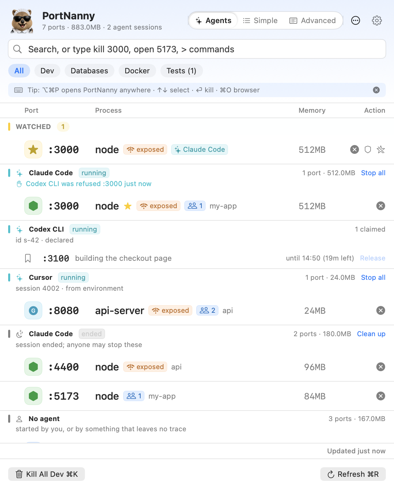
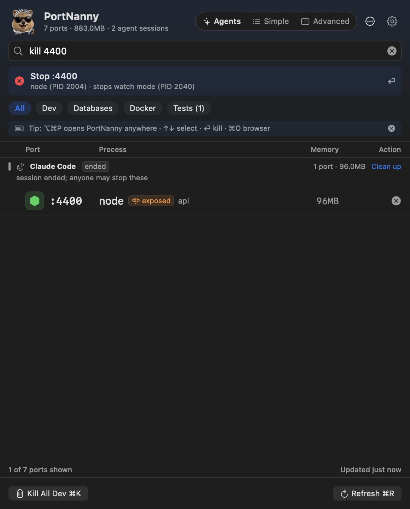

<p align="center">
  
</p>

<p align="center">
  <a href="https://github.com/mukes555/PortNanny/actions/workflows/ci.yml"></a>
  <a href="https://github.com/mukes555/PortNanny/releases/latest"></a>
  
  
  <a href="LICENSE"></a>
</p>

<p align="center">
  <a href="#install">Install</a> ·
  <a href="#the-popover">Popover</a> ·
  <a href="#the-workbench">Workbench</a> ·
  <a href="#for-ai-agents">AI agents</a> ·
  <a href="#the-cli">CLI</a> ·
  <a href="#keyboard">Keyboard</a> ·
  <a href="#settings">Settings</a> ·
  <a href="#privacy-and-safety">Privacy</a>
</p>

Every listening port on your Mac, who started it, and the right way to stop it.
A menu bar app, a Workbench window, a `portnanny` CLI, and an MCP server.

`EADDRINUSE` never says what has the port. A server under pm2 or nodemon comes
straight back when you kill it. And with two AI agents on one machine,
`kill -9 $(lsof -ti:3000)` eventually takes down the wrong one's work.
PortNanny names the owner, stops a supervised server the way its supervisor
expects, and refuses an agent reaching for another agent's port.

<p align="center">
  <picture>
    <source media="(prefers-color-scheme: dark)" srcset="assets/screenshot-dark.png">
    
  </picture>
</p>

<p align="center">
  
  <br><sub>Type <code>3000</code>, press Return, the port is free.</sub>
</p>

## Install

```bash
brew tap mukes555/tap
brew install --cask portnanny        # later: brew upgrade --cask portnanny
```

The cask installs the universal build, clears the Gatekeeper quarantine, and puts `portnanny` on your PATH. There is a DMG in [Releases](https://github.com/mukes555/PortNanny/releases/latest) too; the app is ad-hoc signed rather than notarized, so macOS asks once. Those steps, uninstalling, and [upgrading from PortKilla](docs/FIRST-RUN.md#upgrading-from-portkilla) (the old command, variables, and links all still work) are in [docs/FIRST-RUN.md](docs/FIRST-RUN.md).

Without Homebrew the CLI ships inside the app, at `PortNanny.app/Contents/Helpers/portnanny`; symlink it onto your PATH and run `portnanny completions zsh` for zsh, bash, or fish.

## The popover



<kbd>⌥</kbd><kbd>⌘</kbd><kbd>P</kbd> opens it from any app with the search field focused. Type a port, a process name, or a verb: `kill 3000`, `open 5173`, `watch 8080`, `free port`, or `>` for commands. Return runs it, and the bar above the list says exactly what will happen first.

- **Three tabs, and it opens on Agents.** **Agents** groups what is listening by the session that started it: each agent with its servers, the ports it has reserved and not started on yet, the sessions that have ended (with one button to clean up after them), everything nobody claims, and the AI tools on this Mac with how many of each are running. **Simple** lists every port by kind, one line each. **Advanced** adds the command, CPU with a trend line, the process tree, and chips for project, container, lease, and supervisor.
- **Kill is always visible.** Open in browser appears on web rows and Watch on any row, on hover or keyboard selection, and VoiceOver has both as row actions. <kbd>⌥</kbd>-click force kills, <kbd>⇧</kbd>-click takes the whole process tree. Right-click for the rest: open the project in your editor, reveal it in Finder or Terminal, copy the port, PID, or command, stop a Docker container.
- **Supervisors are understood.** pm2, launchd, Docker, nodemon, `next dev`, `uvicorn --reload`: a plain kill would be undone, so PortNanny runs the supervisor's own stop command and tells you before it does.
- **Watch and guard.** Watched ports sit above the list when you have not typed or filtered, with live status including "free", and notify you when they change. Add a guard to one and it auto-kills whatever takes that port, except a running agent's server, a protected process, or a system port. A guard that fires repeatedly stands itself down rather than fighting a supervisor.
- **Filters and bulk kill.** All, Dev, Databases, and Docker filter the list; Tests instead shows running test processes, which are not listening on anything. <kbd>⌘</kbd><kbd>K</kbd> kills the dev servers in view, or the databases or containers when you pick that filter, skipping protected tools and supervised servers.

## The Workbench

<p align="center"></p>

- **Ports** as a sortable table with project, agent, supervisor, memory, CPU, trend, and age.
- **Projects** groups servers by folder; **Agents** groups them by session, with one click to clean up what an ended session left behind.
- **Watchlist** holds watched ports, guards, and port leases; **History** knows who started and who stopped every port, with CSV export.
- **The inspector** shows who is connected (local, from the local network, from elsewhere), the evidence behind the owner, the port's history, and a peek at a local web server's status and title.

## For AI agents


Running Claude Code, Codex, Cursor, and friends side by side means `kill -9 $(lsof -ti:3000)` eventually kills the wrong server. PortNanny attributes every dev server to the agent session that started it, from two passive signals: the process tree, and the environment markers agents leave on their children (`CLAUDECODE=1` and the like), which survive `nohup`, pm2, and reparenting. No launcher, no registry.

**One rule.** An agent that asks to stop another agent's running server is refused and told why. So is a server nobody claims, which you can switch off in Settings > Agents. Ended sessions never lock a port. People are warned rather than refused, except from an editor's integrated terminal against another agent's live server, where `--force` settles it. When the menu bar app is running, a refusal also raises a notification so you can decide.

```console
$ portnanny kill 3000
:3000 (PID 812) is owned by Cursor (session 812), not Claude Code (session 46200)
Refusing to kill another agent's server. Ask the user, or start yours on a free port. Pass --force only if the user says so; run `portnanny whoami` to check how you are identified.
```

Set the tools up in one go, or piece by piece:

```bash
portnanny setup                                  # asks per tool; --yes applies everything
portnanny agent-docs --claude|--codex|--cursor|--windsurf   # rule files the tools read
portnanny mcp --setup                            # MCP registration for Claude Code, Cursor, Codex
claude plugin marketplace add mukes555/PortNanny && claude plugin install portnanny@portnanny
```

The MCP server gives an agent the guard as a tool rather than a habit it must remember: `list_ports`, `whois_port`, `kill_port`, `free_port`, `reserve_port`, `release_port`, `whoami`, `wait_for_port_free`. Ports can also be leased before use, and `portnanny exec --free-port -- npm run dev` picks a free one, leases it, sets `PORT`, and labels the server. Which tools are recognised and what each should export: [docs/AGENTS.md](docs/AGENTS.md).

## The CLI

Starts in a few milliseconds and links no AppKit. The commands that report take `--json`, each with a documented shape (`portnanny schema kill`).

```bash
portnanny list [--json] [--mine | --agent <name> | --unowned | --orphaned]
portnanny kill 3000 [--force] [--dry-run]        # SIGTERM, verified; also by --pid
portnanny free 3000 && npm run dev               # exit 0 when already free
portnanny wait 3000 --timeout 30                 # block until the port is free
portnanny whois 3000                             # who started it, and the evidence
portnanny whoami                                 # how the guard sees the caller
portnanny agents                                 # who is here, what they run and claim
portnanny history --port 3000 [--all]            # kills, and refusals with --all
portnanny free-port --prefer 3000                # first free port in 3000-3999
portnanny exec --free-port -- npm run dev        # leased, attributed, PORT set
portnanny reserve 3000 --for 10m                 # hold a free port; release, reservations
portnanny drift                                  # servers off the port their config names
portnanny kill --orphaned                        # left behind by ended agent sessions
portnanny doctor --agents                        # how every AI tool is recognised here
```

Also `open`, `release`, `reservations`, `setup`, `agent-docs`, `mcp`, `schema`, `completions`, and `version`. Scripts get distinct exit codes: `0` done, `1` nothing listening, `3` refused, `4` failed or only partly killed, `5` still running after the wait, `6` a supervisor would undo the kill, and `portnanny help kill` lists the rest. There is a URL scheme too: `open "portnanny://kill/3000"` (add `?force=1` for SIGKILL; both ask first) or `portnanny://show`.

## Keyboard

In the popover.

| Keys | Action |
| --- | --- |
| <kbd>⌥</kbd><kbd>⌘</kbd><kbd>P</kbd> | Open PortNanny from anywhere (changeable in Settings) |
| <kbd>↑</kbd> <kbd>↓</kbd> | Move the selection |
| <kbd>→</kbd> <kbd>←</kbd> | Expand or collapse the process tree, once the search field is empty |
| <kbd>⏎</kbd>, <kbd>⌘</kbd><kbd>⏎</kbd> | Run what you typed or kill the selection, force kill |
| <kbd>⌘</kbd><kbd>O</kbd>, <kbd>⌘</kbd><kbd>C</kbd> | Open `localhost:<port>`, copy the port (⌘C once the search field is empty) |
| <kbd>⌘</kbd><kbd>K</kbd>, <kbd>⌘</kbd><kbd>R</kbd> | Bulk kill the current filter, refresh |
| <kbd>⌘</kbd><kbd>,</kbd>, <kbd>Esc</kbd> | Settings; clear the search, then close |

## Settings


Six panes: **General** (login item, refresh, confirmations, a switch per notification, watched ports), **Display** (size, the tab it opens on, which ports to hide, the menu bar icon and count), **Agents** (the unclaimed-server switch, per-tool setup, lease length), **Shortcuts**, **Protected** (names bulk kills never touch), and **About** (updates, debug info, reset).

The menu bar shows the quokka and, if you want it, how many ports you own, leaving out system daemons and your editors. Pin the popover as a floating window when you want it to stay put.

## Privacy and safety

No accounts, no telemetry. The only request that leaves your Mac is the daily release check, which you can turn off; the inspector's Peek is an HTTP GET to `127.0.0.1` and goes no further. Command lines are redacted (`--token=`, `KEY=`, URL passwords, bearer tokens) before they are shown, exported, or handed to an agent. Kills verify the process is still the one you meant, bulk kills skip protected names and supervised servers, and the guard, the one automation that kills without asking, never touches a running agent's server. Ports come from kernel calls (libproc) in a few milliseconds, with `lsof` and `ps` as sandbox fallbacks the footer tells you about, and `docker ps` only to name containers.

## Requirements and building

To build it yourself:

```bash
git clone https://github.com/mukes555/PortNanny.git
cd PortNanny/PortNanny            # the Swift package is nested
./scripts/build.sh                # dist/PortNanny.app; add --dmg for a disk image
```

`swift run PortNanny` launches the app and `swift test --disable-sandbox` runs the suite. Then [CONTRIBUTING.md](CONTRIBUTING.md), the module map in [ARCHITECTURE.md](ARCHITECTURE.md), the quokka in [docs/ARTWORK.md](docs/ARTWORK.md), reports in [SECURITY.md](SECURITY.md), history in [CHANGELOG.md](CHANGELOG.md).

## License

MIT. Free for personal and commercial use.
